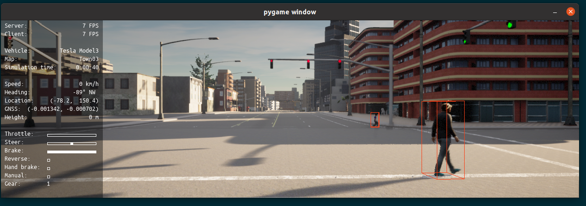

## CARLA-Kitti Setup & Installation Guide

A step-by-step guide for installing CARLA-KITTI data collector to generate synthetic data and export it to KITTI data format.

Some of the features of the "CARLA-KITTI data collector" include:

- Visualization of 2D/3D bounding boxes around agents in the simulation
- Visualization of LiDAR point cloud (either "ray_cast or "blickfeld" ) of the world in the simulation
- Support for the autopilot mode of traversing the city while collecting data


#### 1) CARLA Prerequisites 

Before installing CARLA, we need to install the **PyGame** package.
However, before installing PyGame, we need to install the following packages at the (Linux) system-level:

```bash
$ sudo apt-get install python3-pip python-dev libsdl-image1.2-dev
$ sudo apt-get install libsdl-mixer1.2 libsdl-mixer1.2-dev libsdl-ttf2.0 libsdl-ttf2.0-dev
$ sudo apt-get install libportmidi-dev libfreetype6-dev
```


#### 2) Installing Anaconda

Next we will have to install a Python distribution. Here, we will prefer the Anaconda distribution. 

```bash
$ wget -c https://repo.anaconda.com/archive/Anaconda3-2020.07-Linux-x86_64.sh
$ bash Anaconda3-2020.07-Linux-x86_64.sh
```


#### 3) Conda environment

For encapsulating the required packages in a self-contained environment, we will use a conda environment and install the Python packages required for running CARLA.

```bash
$ conda create -n carla python=3.8
$ conda activate carla
```

Now, we are ready to install PyGame in the conda env that we just created:

```bash
$ pip install -U pygame==2.0
```

We also need some additional but necessary packages:

```bash
$ conda install -c conda-forge numpy matplotlib opencv scikit-learn scipy
$ conda install -c open3d-admin open3d pyyaml addict pandas plyfile networkx
```


#### 4) Installing CARLA

Now, we are ready to install CARLA from the pre-compiled binaries

- First, download a suitable (development) version from the below URL. 
- https://github.com/carla-simulator/carla/blob/master/Docs/download.md
  (Use the vanilla version of [Carla 0.9.10](https://carla-releases.s3.eu-west-3.amazonaws.com/Linux/CARLA_0.9.10.tar.gz)).  (Not RSS)

- Also, download the corresponding `AdditionalMaps` tar.gz file that comes bundled with a specific CARLA version.
  (For Carla 0.9.10, it should be [AdditionalMaps-0.9.10](https://carla-releases.s3.eu-west-3.amazonaws.com/Linux/AdditionalMaps_0.9.10.tar.gz))

After downloading, extract the `tar.gz` files to the desired location. For example, `/home/mario/CARLA_0.9.10`.

#### 5) Running CARLA

First, to make the CARLA python distribution binary visible in `PYTHONPATH`, define the following environment variables in `.bashrc` or `.zshrc`:

```bash
CARLAHOME="/home/mario/CARLA_0.9.10"
CARLAPYTHONDIST="$CARLAHOME/PythonAPI/carla/dist/carla-0.9.10-py3.7-linux-x86_64.egg"
export PYTHONPATH=$CARLAPYTHONDIST
```


Since we will also run CARLA simulator to collect (training) data using [`carla-kitti-data-collector`](https://iceland.sb.dfki.de/bitbucket/users/farzad.nozarian/repos/carla-kitti-data-collector/browse), we need the following paths as well:

```bash
CARLAPYAPI="$CARLAHOME/PythonAPI"
export PYTHONPATH=$PYTHONPATH:$CARLAPYAPI:"$CARLAPYAPI/carla":"$CARLAPYAPI/carla/agents":"$CARLAPYAPI/examples"
```


Another alias needed by `carla-kitti-data-collector/data_collector.py`:

```bash
CARLA_ROOT=$CARLAHOME
export CARLA_ROOT
```

Compile the changes with the following command or log out the system and login again.

```bash
$ source ~/.bashrc
```

Now, run the CARLA server:

```bash
$ cd ~/carla_0.9.10
$ bash ImportAssets.sh
$ bash CarlaUE4.sh -benchmark -fps=10 -quality-level=Epic -opengl
```

If everything works out fine, you will see a CarlaUE4 window showing buildings, road, trees, street lamps, etc.

#### 6) Running the data collector

Activate the environment and run the data collector python module:

```bash
$ conda activate carla
$ python -m data_collector --loop
```

This will show a PyGame window with default number of actors in the simulation. Check out `data_collector.py` for further parameters.

#### 7) Visualization

i) To visualize 3D bounding boxes around agents (i.e., vehicles, pedestrians, cyclists, etc.), use the following flag:

```bash
$ python -m data_collector --loop --vis_boxes3d
```




ii) To visualize LiDAR point cloud of the simulation, use the following flag:

```bash
$ python -m data_collector --loop --vis_lidar
```


For more help with the command-line arguments, use:

```bash
$ python data_collector.py --help

usage: data_collector.py [-h] [-v] [--host H] [-p P] [--res WIDTHxHEIGHT] [--filter PATTERN] [--gamma GAMMA] [-l] [-s SEED] [--vis_lidar] [--vis_boxes3d] [--vis_boxes2d] [--vis_ry] [--vis_alpha][--steps_between_recordings STEPS_BETWEEN_RECORDINGS] [--lidar_data_format LIDAR_DATA_FORMAT] [--distance_since_last_recording DISTANCE_SINCE_LAST_RECORDING][--num_recordings_before_reset NUM_RECORDINGS_BEFORE_RESET] [--num_empty_frames_before_reset NUM_EMPTY_FRAMES_BEFORE_RESET] [--lidars LIDARS [LIDARS ...]][--lidar_range LIDAR_RANGE] [--save_data] [--phase PHASE] [--output_dir OUTPUT_DIR] [--fps FPS] [-a]

optional arguments:
  -h, --help            show this help message and exit
  -v, --verbose         Print debug information
  --host H              IP of the host server (default: 127.0.0.1)
  -p P, --port P        TCP port to listen to (default: 2000)
  --res WIDTHxHEIGHT    Window resolution (default: 1280x720)
  --filter PATTERN      Actor filter (default: "vehicle.*")
  --gamma GAMMA         Gamma correction of the camera (default: 2.2)
  -l, --loop            Sets a new random destination upon reaching the previous one (default: False)
  -s SEED, --seed SEED  Set seed for repeating executions (default: None)
  --vis_lidar           Whether or not to visualize lidar point clouds.
  --vis_boxes3d         Whether or not to visualize 3D bounding boxes for agents.
  --vis_boxes2d         Whether or not to visualize 2D bounding boxes for agents.
  --vis_ry              Whether or not to visualize rotation ry of agents around Y-axis.
  --vis_alpha           Whether or not to visualize the object observation angle (alpha) of the vehicle with camera.
  --steps_between_recordings STEPS_BETWEEN_RECORDINGS
                        How many frames to wait between each capture of screen, bounding boxes and lidar.
  --lidar_data_format LIDAR_DATA_FORMAT
                        Lidar can be saved in bin to comply to kitti, or the standard .ply format
  --distance_since_last_recording DISTANCE_SINCE_LAST_RECORDING
                        How many meters the car must drive before a new capture is triggered.
  --num_recordings_before_reset NUM_RECORDINGS_BEFORE_RESET
                        How many datapoints to record before resetting the scene.
  --num_empty_frames_before_reset NUM_EMPTY_FRAMES_BEFORE_RESET
                        How many frames to render before resetting the environment. For example, the agent may be stuck
  --lidars LIDARS [LIDARS ...]
                        List of lidar types used for visualization and data collection.Available options are "ray_cast" and "blickfeld"
  --lidar_range LIDAR_RANGE
                        Max render depth in meters
  --save_data           Whether or not to save training data
  --phase PHASE         Phase can be one of (training|val|test)
  --output_dir OUTPUT_DIR
                        Path to output directory
  --fps FPS             Simulation FPS
  -a, --autopilot       Enable default autopilot. If not, a behavior agent will be used

```

